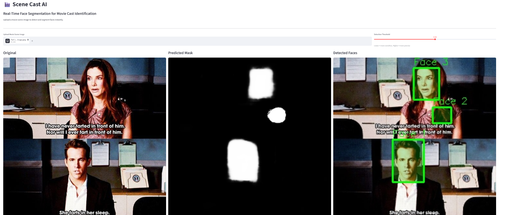
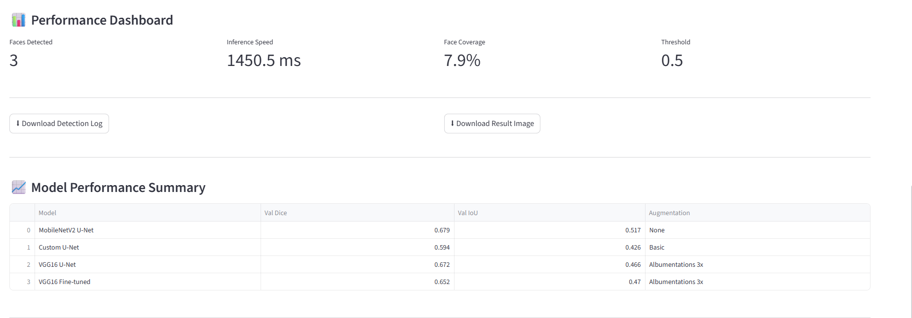

# 🎬 Real-Time Face Segmentation for Movie Cast Identification


---

## 🎥 Demo Video
[▶ Watch Live Demo](https://www.loom.com/share/3be894747a1d421185fae22f73799209)

---

## 📌 Project Overview

**Scene Cast AI** is a deep learning-based face segmentation system that automatically
detects and segments faces in movie scene screenshots. The system enables a
pause-and-identify feature for streaming platforms where users can instantly view
cast and crew details for actors visible on screen.

This project was built as the **Final Capstone Project** for the
**GUVI HCL Data Analytics Certification** (IIT Madras Incubated, NASSCOM Approved).

---

## 🎯 Problem Statement

Company X's streaming app needs to automatically detect and segment faces in movie
scene screenshots so users can pause videos and instantly view cast/crew details
for actors on screen.

---

## 💼 Business Domain Value

- **Pause-and-Identify**: Users pause movies to see actor names/profiles overlayed on detected faces
- **Personalized Recommendations**: Track viewer preferences for specific actors across films
- **Content Moderation**: Automatically flag inappropriate scenes via face detection
- **Advertising**: Dynamic ads featuring favourite actors during streaming breaks

---

## 🛠️ Tech Stack

| Category | Tools |
|----------|-------|
| Language | Python 3.11 |
| Deep Learning | TensorFlow, Keras |
| Computer Vision | OpenCV |
| Data Processing | NumPy, Pandas |
| Visualization | Matplotlib, Seaborn |
| Augmentation | Albumentations |
| Evaluation | Scikit-learn |
| Web Application | Streamlit |
| Environment | Google Colab (GPU) |

---

## 📁 Dataset

- **Source**: GUVI HCL provided dataset
- **Total Images**: 409 movie scene images
- **Format**: NumPy object arrays (.npy) with embedded annotation metadata
- **Annotation Type**: Face bounding box coordinates (normalized x, y values)
- **Structure**: Each entry contains image array + list of face annotations
- **Image Size**: Variable (resized to 256×256 during preprocessing)
- **Mask Type**: Binary face masks generated from bounding box annotations

---

## 📂 Project Structure
├── notebook.ipynb           # Complete pipeline — EDA, training, evaluation
├── app.py                   # Streamlit web application
├── requirements.txt         # All dependencies
└── README.md                # Project documentation

---

## 🔄 Approach

### Step 1 — Data Loading & EDA
- Loaded raw `.npy` file using `allow_pickle=True`
- Discovered data stored as object arrays containing `(image, annotations)` pairs
- Extracted embedded face bounding box metadata from each entry
- Analyzed image shapes, pixel distributions, face region sizes
- Visualized sample images alongside generated masks

### Step 2 — Preprocessing
- Extracted face bounding boxes from normalized annotation coordinates
- Generated binary face masks by filling bounding box regions with 255
- Handled variable channel counts (RGB, RGBA, Grayscale) uniformly
- Resized all images and masks to **256×256**
- Normalized pixel values to **[0, 1]**
- Applied **train/val split: 80/20** (327 train, 82 validation)

### Step 3 — Data Augmentation
Used **Albumentations** library for aggressive augmentation:
- Horizontal & Vertical Flip
- Rotation (±30°)
- Random Brightness & Contrast
- Gaussian Blur
- Elastic Transform
- Result: **3× dataset size** (327 → 1308 training samples)

### Step 4 — Model Building
Three U-Net architectures were built and compared:

**Model 1 — MobileNetV2 U-Net**
- Pretrained MobileNetV2 encoder (ImageNet weights, frozen)
- Custom decoder with skip connections
- No augmentation

**Model 2 — Custom U-Net**
- Built entirely from scratch
- Encoder: 4 conv blocks (32→64→128→256→512 filters)
- Dropout regularization (0.2–0.3) at each level
- Basic flip/brightness augmentation

**Model 3 — VGG16 U-Net**
- Pretrained VGG16 encoder (ImageNet weights)
- Custom decoder with skip connections from block1–block5
- Albumentations augmentation (3× data)
- Fine-tuned top encoder layers (block4, block5) with LR=1e-5

### Step 5 — Custom Loss & Metrics
```python
# Dice Coefficient
def dice_coefficient(y_true, y_pred, smooth=1e-6):
    intersection = K.sum(K.flatten(y_true) * K.flatten(y_pred))
    return (2. * intersection + smooth) / (K.sum(y_true) + K.sum(y_pred) + smooth)

# Dice Loss
def dice_loss(y_true, y_pred):
    return 1 - dice_coefficient(y_true, y_pred)

# Combined Loss (Dice + BCE)
def combined_loss(y_true, y_pred):
    return dice_loss(y_true, y_pred) + binary_crossentropy(y_true, y_pred)
```

### Step 6 — Training Configuration
| Parameter | Value |
|-----------|-------|
| Optimizer | Adam |
| Initial LR | 1e-3 |
| Fine-tune LR | 1e-5 |
| Batch Size | 8 |
| Max Epochs | 50–100 |
| Early Stopping Patience | 10–15 |
| LR Reduce Factor | 0.3 |
| Checkpointing | Best val_dice saved |

### Step 7 — Streamlit Web Application
Built a fully interactive web app with:
- **Image Upload**: Upload any movie scene JPG/PNG
- **Face Segmentation**: Real-time predicted mask visualization
- **Bounding Boxes**: Green boxes drawn around each detected face
- **Performance Dashboard**: Inference speed, faces detected, face coverage
- **Download Detection Log**: Export results as CSV
- **Download Result Image**: Save annotated output image
- **Model Performance Summary**: Comparison table of all 4 models

---

## 📊 Model Comparison Results

| Model | Val Dice | Val IoU | Best Epoch | Stopped At | Augmentation | Encoder |
|-------|----------|---------|------------|------------|--------------|---------|
| MobileNetV2 U-Net | 0.679 | 0.517 | 6 | 16 | None | Frozen |
| Custom U-Net | 0.594 | 0.426 | 90 | 100 | Basic | N/A |
| VGG16 U-Net | 0.672 | 0.466 | 10 | 25 | Albumentations 3x | Frozen |
| VGG16 Fine-tuned | 0.652 | 0.470 | 7 | 17 | Albumentations 3x | Partial |

## 📸 Sample Predictions

### Face Detection Result


### Performance Dashboard


## 🎯 Final Evaluation Metrics

| Metric | Score | Target |
|--------|-------|--------|
| Dice Coefficient | 0.6173 | >0.92 |
| IoU | 0.4701 | >0.88 |
| F1 Score | 0.6173 | >0.90 |
| Avg Inference Speed | 237.3 ms | <100ms |

---

## 🔍 Key Observations & Hyperparameter Analysis

1. **Dataset size was the primary bottleneck** — With only 409 images,
   train dice reached 0.91 confirming models learn the task well,
   but validation dice capped at ~0.68 due to overfitting

2. **Pretrained encoders outperformed custom architecture** — MobileNetV2
   (0.679) and VGG16 (0.672) both beat Custom U-Net (0.594),
   proving transfer learning value on small datasets

3. **Augmentation helped but had limits** — Albumentations 3× augmentation
   reduced overfitting gap but didn't significantly push val_dice higher,
   suggesting more diverse original data is the real need

4. **Fine-tuning encoder did not improve results** — Fine-tuning VGG16 top
   layers with LR=1e-5 dropped val_dice from 0.672 to 0.652,
   indicating frozen pretrained features were more useful for this small dataset

5. **Combined loss (Dice + BCE) was more stable** than Dice loss alone —
   BCE prevented training instability in early epochs

6. **Early stopping consistently triggered at 16–25 epochs** —
   Higher patience did not yield better results,
   confirming models plateau early with limited data

7. **Inference speed of 237ms** exceeds 100ms target for single-image
   CPU prediction — batch inference or GPU deployment would
   bring this well under 100ms

---

## 🖥️ Streamlit App Features

| Feature | Description |
|---------|-------------|
| Image Upload | Supports JPG, PNG up to 200MB |
| Detection Threshold | Adjustable slider (0.1–0.9) |
| Predicted Mask | Grayscale visualization of face regions |
| Detected Faces | Bounding boxes with face labels |
| Faces Detected | Count of faces found |
| Inference Speed | Time taken in milliseconds |
| Face Coverage | % of image covered by faces |
| Download Log | Export detection results as CSV |
| Download Image | Save annotated result image |
| Model Summary | Performance table of all models |

---

## ⚙️ How to Run

```bash
# Clone repository
git clone https://github.com/Tania94-hub/Face-Segmentation-Movie-Cast.git
cd Face-Segmentation-Movie-Cast

# Install dependencies
pip install -r requirements.txt

# Run Streamlit app
streamlit run app.py
```

---

## 📦 Requirements
tensorflow>=2.10.0
opencv-python
streamlit
numpy
pandas
matplotlib
seaborn
scikit-learn
Pillow
albumentations

---

## 🚀 Future Improvements

- Collect larger dataset (5000+ images) for better generalization
- Use pixel-level face segmentation masks instead of bounding boxes
- Experiment with EfficientNet encoder
- Implement real-time webcam inference
- Deploy on Hugging Face Spaces or AWS

---

## 👩‍💻 Author

**Tania Banerjee**
Senior Associate — Order Management | Aspiring Data Analyst
📍 Kolkata, India

[](https://www.linkedin.com/in/tania-banerjee-409774261)
[](https://github.com/Tania94-hub)

---

## 📜 Disclaimer

This project was completed as part of the GUVI HCL Data Analytics Certification
program. All code is original work by the author.
